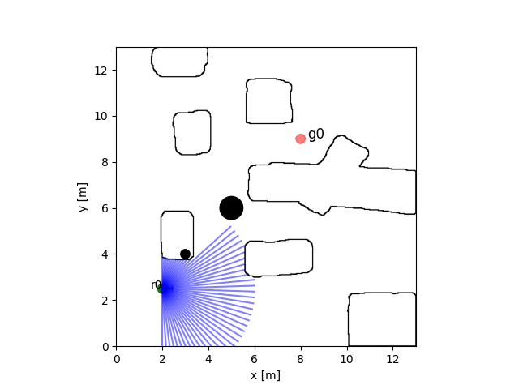
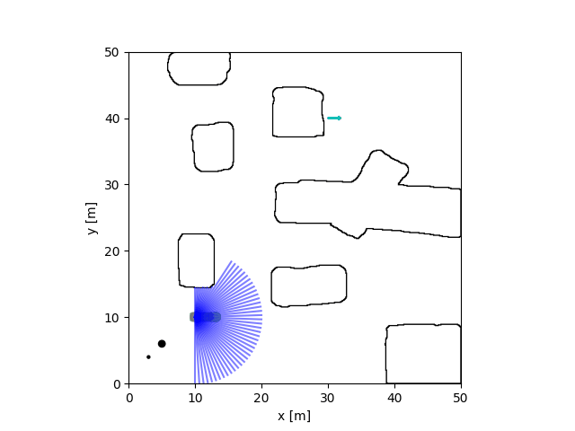

# intelligent-robot-simulator

A simple 2D simulator for the mobile robots to perform the robotics algorithm with Python.  

Robot             |  Car
:-------------------------:|:-------------------------:
  |  

- Features:  
    - Simple and easy to run with python;  
    - All the models and parameters can be set directly in the yaml configure file;  
    - Environment can be built easily by line, circle model and png images;  
    - Three robot kinematics models: omni-wheel, differential wheel, arckermann;  
    - Including collision check with environment;  
    - Equipped with Lidar sensor;  
    - Support keyboard controller;  
    - Easy to extend for your own project. 

<!-- The functions are incomplete and incomprehensive now. Welcome to propose your requirement to improve this simulator. -->

## Prerequisite

Test platform: Ubuntu20.04, windows10

- Python: 3.8
    - numpy  
    - matplotlib  
    
## Installation

clone the repository

```
git clone https://github.com/hanruihua/intelligent-robot-simulator.git
```

install the package (ir_sim)

```
cd intelligent-robot-simulator
pip install -e .
```

## Usage

The examples are in the ir-sim/usage
